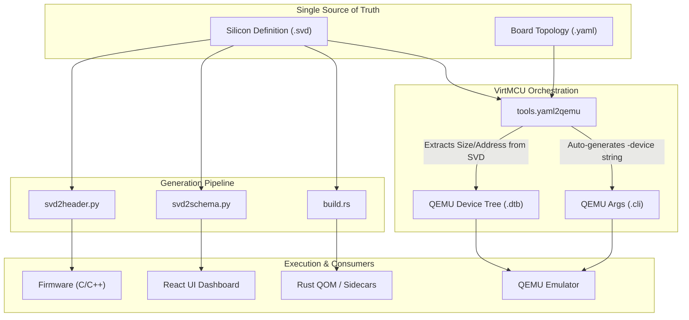

# Silicon Definition (SVD) and Register SSOT

## 1. Introduction to CMSIS-SVD in VirtMCU

VirtMCU strives for absolute binary fidelity. Firmware running in the digital twin must execute unmodified. This requires that the virtual peripherals exposed by the QEMU plugin layer precisely match the memory layout (MMIO) of the physical silicon.

To guarantee this, VirtMCU adopts the **CMSIS-SVD (System View Description)** standard as the **Single Source of Truth (SSOT)** for all MMIO definitions. 

SVD is an XML-based industry standard created by ARM. It exhaustively defines the memory map, peripherals, registers, and bitfields of a microcontroller. By leveraging SVD, VirtMCU eliminates the drift that typically occurs when C headers, UI schemas, and emulator backends are written independently.

## 2. Preventing Data Overlap: Who Owns What?

To maintain a true Single Source of Truth, we draw strict boundaries between files to ensure no hardware parameter is ever defined twice. Furthermore, each file type has a designated authoring authority.

*   **SVD (`.svd` XML): Owns the Micro-Architecture.** It holds the absolute definition of peripheral base addresses, region sizes, registers, bitfields, and reset values.
    *   **Author/Authority:** **Silicon Vendors** (e.g., ARM, STMicro, Nordic). We ingest these vendor files directly. They are rarely hand-written by our engineers unless designing a custom virtual peripheral (like `mmio-bridge`).
*   **Board Topology (`.yaml`): Owns the Macro-Architecture.** It defines *which* peripherals are instantiated, their parent buses, and their networking links (e.g., `socket-path`).
    *   **Author/Authority:** **Hardware Simulation Engineers / System Integrators**. They define the specific topology for a digital twin project.
    *   *Crucial Rule:* A `.yaml` file **MUST NOT** hardcode the `address` or `size` for a peripheral if an SVD is available. Instead, it defines an `svd` property pointer. The orchestration tooling dynamically extracts the address/size from the SVD.
*   **Docker Compose (`.yml`): Owns Container Orchestration.** It handles process lifecycle but has **zero** knowledge of peripheral addresses, memory maps, or QEMU `-device` arguments.
    *   **Author/Authority:** **DevOps / Platform Engineers**.

## 3. Data Flow and Generation Pipeline

The architecture is strictly unidirectional: `SVD -> Artifacts`.

The generated artifacts are strictly consumed by specific boundaries at distinct phases:

1.  **Orchestration Config (`.dtb` and `.cli`)**: 
    *   **Generated By**: `yaml2qemu`
    *   **Consumed By**: The QEMU emulator (`qemu-system-arm`), strictly at **Boot Time**. QEMU parses the DTB to construct the memory map and reads the `.cli` payload to instantiate the exact `-device` arguments (like `mmio-socket-bridge`) derived from the SVD.
2.  **C Headers (`robot_io.h`)**: 
    *   **Generated By**: `svd2header.py`
    *   **Consumed By**: The C/C++ Compiler (`gcc`), strictly at **Compile Time**. Firmware engineers `#include` these headers to get guaranteed-correct MMIO offsets without hand-rolling structs. It embeds `_Static_assert` validations to enforce alignment and type sizes.
3.  **UI Schemas (`schema.json`)**: 
    *   **Generated By**: `svd2schema.py`
    *   **Consumed By**: The React Dashboard (Frontend), at **Runtime/Build Time**. The UI parses the schema to dynamically render control panels, sliders, and telemetry charts matching the SVD bounds (Targets vs State).
4.  **Rust Constants (`svd_constants.rs`)**: 
    *   **Generated By**: A `build.rs` script in the QEMU plugin or sidecar.
    *   **Consumed By**: The Rust Compiler (`rustc`), strictly at **Compile Time**. This ensures the Rust backend (like `mmio_bridge`) statically knows the correct offsets and boundaries for packing network payloads.

By enforcing this pipeline, changing a register offset in the SVD automatically updates the firmware, the UI, the simulation orchestrator, and the emulator memory map in a single pass.

## 3. Why CMSIS-SVD instead of Zephyr/DeviceTree?

Zephyr OS utilizes a highly successful paradigm based on DeviceTree (DTS) and YAML bindings to generate C macros at compile time. While powerful, VirtMCU deliberately chooses SVD over the Zephyr approach for several reasons:

* **RTOS Agnosticism:** Zephyr's macro generation is deeply coupled to its own build system (CMake/Kconfig) and assumes Zephyr's driver model. VirtMCU supports bare-metal C, FreeRTOS, Linux, and Zephyr. SVD provides an RTOS-agnostic, raw silicon description.
* **Industry Standard Vendor Support:** Silicon vendors natively publish SVDs for their chips (e.g., STMicro, NXP, Nordic). By using SVD, we can ingest vendor definitions directly without needing to translate them into custom YAML bindings.
* **Micro-Architecture Focus:** DeviceTree excels at describing board-level topology (e.g., "UART2 is connected to GPIO pins 4 and 5"). SVD excels at micro-architecture (e.g., "The UART2 Baud Rate register is at offset 0x0C and bits 4:7 control parity"). VirtMCU uses both: DeviceTree for the `arm-generic-fdt` QEMU machine layout, and SVD for internal peripheral registers.

## 4. Mapping SVD under the OpenUSD Umbrella

VirtMCU's parent platforms (like FirmwareStudio) are adopting OpenUSD to describe the 3D, physical, and cyber-spatial world. 

**How they interact:**
OpenUSD describes the **Macro-Architecture**; SVD describes the **Micro-Architecture**.

1. **OpenUSD (World Definition):** Defines that a "Robot Arm" exists at coordinates `[0, 0, 0]`, has 3 joints, and mass properties. It defines the macroscopic topology of the digital twin.
2. **The Bridging Link:** The OpenUSD schema contains a custom property (e.g., `reflow:svdPath = "hw/defs/robot_arm.svd"`) attached to the Robot's Cyber-Node prim.
3. **SVD (Silicon Definition):** Defines exactly how the firmware talks to those 3 joints via MMIO. OpenUSD knows *what* the robot is; SVD knows *how the CPU commands it*.

By keeping SVD nested under the OpenUSD node, we cleanly separate 3D/Kinematic modeling from CPU/Register-level modeling while keeping both completely declarative.