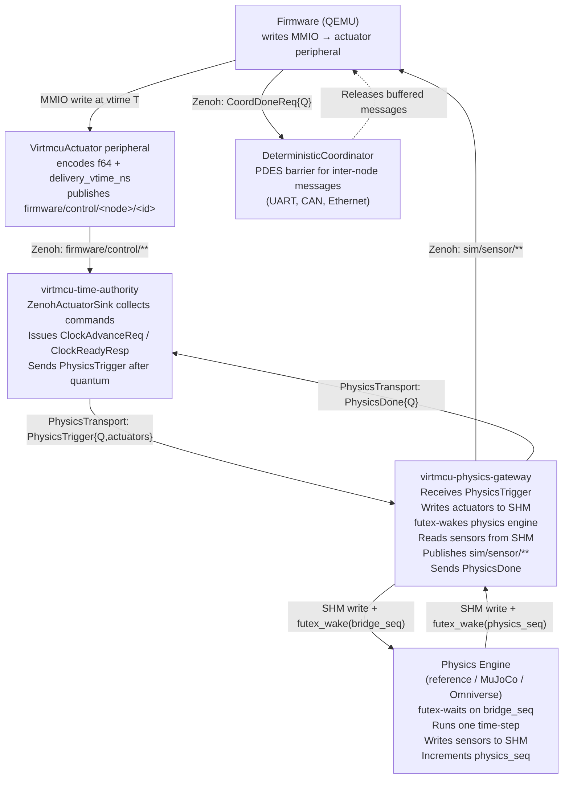
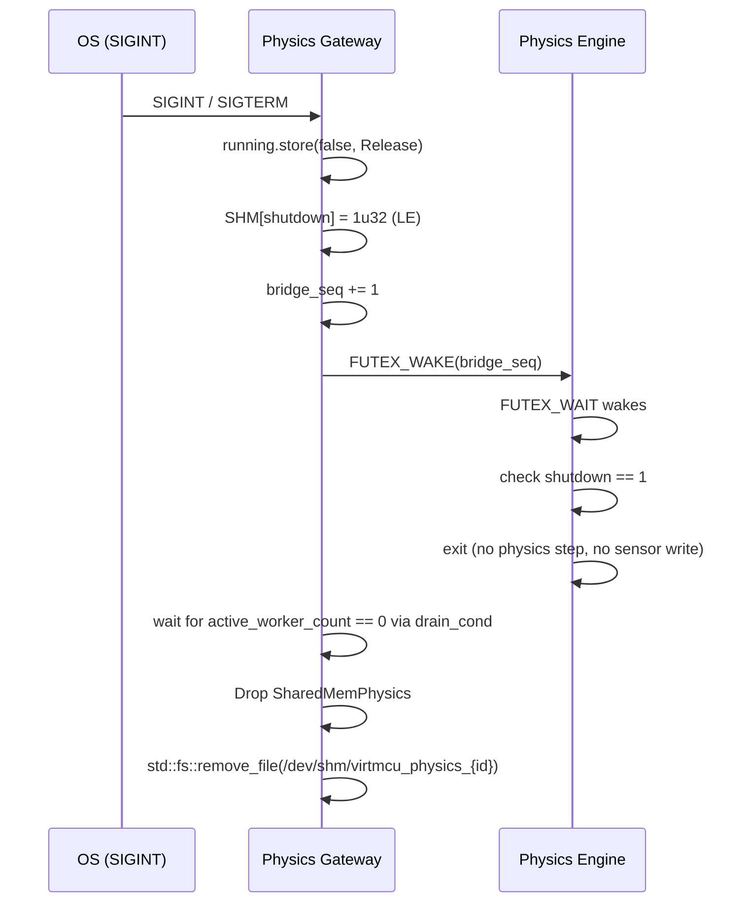

# Physics Gateway: Decoupled Cyber-Physical Integration

## Learning Objectives
After this chapter, you can:
1. Explain why physics synchronization was separated from the Time Authority.
2. Describe the SHM wire protocol and the futex-based signalling contract.
3. Trace a single quantum from firmware MMIO write to physics step completion.
4. State the co-location constraints and how they map to a Docker Compose deployment.

---

## 1. Motivation and Design History

### 1.1 The Monolithic Baseline

The original design fused the physics data bridge directly into the `virtmcu-time-authority` binary. Each quantum, the Time Authority would:

1. Issue `ClockAdvanceReq` to all QEMU nodes.
2. Wait for `ClockReadyResp` from all nodes.
3. Drain actuator commands from an internal Zenoh subscriber.
4. Write actuator values to a shared-memory file.
5. Spin-poll until the physics engine updated a sequence counter.
6. Read sensor values back from shared memory and publish them to Zenoh.
7. Issue the next `ClockAdvanceReq`.

This worked, but violated three principles:

| Violation | Consequence |
|---|---|
| Time management entangled with data routing | Time Authority could not be unit-tested without a real physics engine |
| Spin-polling (1 ms `sleep` loop) | 100 % CPU utilisation on one core during every physics step |
| No RAII for the `/dev/shm` file | Stale files on crash silently truncated and reused on the next run |
| `mujoco_seq` name baked into the public SHM protocol | Any physics engine had to pretend to be MuJoCo |

### 1.2 The Decoupled Architecture

The Physics Gateway is a new binary (`virtmcu-physics-gateway`) that takes over all shared-memory and physics-engine communication. The Time Authority is stripped back to its single responsibility: issuing `ClockAdvanceReq` / `ClockReadyResp` to QEMU nodes.

```
Before                              After
──────                              ─────
┌─────────────────────────┐         ┌──────────────────┐   ┌──────────────────────┐
│   virtmcu-time-authority │         │  virtmcu-time-   │   │ virtmcu-physics-     │
│                         │         │  authority       │   │ gateway              │
│  ┌──────────────────┐   │         │                  │   │                      │
│  │  Clock logic     │   │         │  Clock logic     │   │  PhysicsGateway      │
│  │  Zenoh actuator  │   │  ─────► │  Zenoh actuator  │──►│  Server              │
│  │  subscriber      │   │         │  subscriber      │   │                      │
│  │  SHM mmap        │   │         │  PhysicsGateway  │   │  SHM mmap + futex    │
│  │  Spin-poll loop  │   │         │  Transport       │   │  RAII Drop           │
│  └──────────────────┘   │         └──────────────────┘   └──────────┬───────────┘
└─────────────────────────┘                                            │
                                                               /dev/shm (SHM)
                                                                       │
                                                           ┌───────────▼───────────┐
                                                           │   Physics Engine      │
                                                           │  (any: reference,     │
                                                           │   MuJoCo, Omniverse)  │
                                                           └───────────────────────┘
```

---

## 2. Component Roles



---

## 3. The SHM Wire Protocol

The gateway and the physics engine share a single memory-mapped file at
`/dev/shm/virtmcu_physics_{node_id}`. The layout is fixed for the lifetime of the
process. All fields are little-endian.

### 3.1 Header Layout (24 bytes, fixed)

```
Byte offset   Size   Type    Name           Description
───────────   ────   ─────   ─────────────  ──────────────────────────────────────────
0             4      u32     n_sensors      Number of sensor f64 slots in the data section
4             4      u32     n_actuators    Number of actuator (ctrl) f64 slots
8             4      u32     bridge_seq     Gateway increments → signals physics engine
12            4      u32     physics_seq    Physics engine increments → signals gateway
16            4      u32     shutdown       1 = clean exit requested; 0 = running
20            4      u32     reserved       Must be zero. Reserved for future flags.
24            …      f64[]   sensor data    n_sensors × 8 bytes (physics engine writes)
24 + n_s*8    …      f64[]   actuator data  n_actuators × 8 bytes (gateway writes)
```

The data section always begins at byte 24 regardless of how many header fields are used,
preserving backward compatibility with physics engines that hardcode the offset.

Named constants in Rust (`physics.rs`):

```rust
pub const SHM_OFF_N_SENSORS:   usize = 0;
pub const SHM_OFF_N_ACTUATORS: usize = 4;
pub const SHM_OFF_BRIDGE_SEQ:  usize = 8;
pub const SHM_OFF_PHYSICS_SEQ: usize = 12;
pub const SHM_OFF_SHUTDOWN:    usize = 16;
pub const SHM_OFF_RESERVED:    usize = 20;
pub const SHM_DATA_OFFSET:     usize = 24;
pub const SHM_HEADER_SIZE:     usize = 24;
```

### 3.2 Signalling Contract

The two sequence counters implement a two-phase doorbell using the Linux `futex(2)` syscall. Because both processes map the same physical pages (`/dev/shm` is backed by tmpfs), `FUTEX_WAIT` and `FUTEX_WAKE` operate on the shared physical page address — no file descriptor exchange is required.

```
Gateway                                 Physics Engine
───────                                 ──────────────
write actuator values to SHM data
bridge_seq += 1  (u32, wrapping)
FUTEX_WAKE(bridge_seq, 1)
                                        FUTEX_WAIT(bridge_seq, prev_val)
                                        ← wakes when bridge_seq changes
                                        check shutdown flag (if 1: exit cleanly)
                                        read actuator data from SHM
                                        run one physics time-step
                                        write sensor data to SHM
                                        physics_seq = bridge_seq  (u32)
                                        FUTEX_WAKE(physics_seq, 1)
FUTEX_WAIT(physics_seq, prev_val)
← wakes when physics_seq changes
read sensor data from SHM
publish sim/sensor/** to Zenoh
```

**`EAGAIN` handling (mandatory):** `FUTEX_WAIT` returns `EAGAIN` if the value at the
address has already changed before the syscall executes. Both sides must treat `EAGAIN`
as a retry, not an error:

```rust
loop {
    let current = (*ptr).load(Ordering::Acquire);
    if current == expected { break; }
    let ret = libc::syscall(SYS_futex, ptr, FUTEX_WAIT, current, &timeout_ts, ...);
    if ret == -1 {
        match *libc::__errno_location() {
            libc::EAGAIN | libc::EINTR => continue,   // value changed / signal — retry
            libc::ETIMEDOUT            => continue,   // kernel timeout — check wall-clock
            e => return Err(anyhow!("futex error: errno {e}")),
        }
    }
}
```

### 3.3 Physics Engine Integration

Any physics engine that maps `/dev/shm/virtmcu_physics_{node_id}` and speaks the
two-counter protocol becomes a first-class participant. The engine must:

1. Open the file after it exists (retry until `/dev/shm/virtmcu_physics_*` appears).
2. Read `n_sensors` and `n_actuators` from the header.
3. Loop: `FUTEX_WAIT(bridge_seq, prev)` → check `shutdown` → step → `FUTEX_WAKE(physics_seq)`.

For Python test stubs, `FUTEX_WAIT` is not available from pure Python. The Python mock
uses a tight spin-poll (`time.sleep(0.001)`) on the `u32` counter — acceptable for
correctness testing but not production throughput.

---

## 4. FlatBuffers Wire Protocol (TA ↔ Gateway)

The Time Authority and the Physics Gateway exchange two message types, defined in
`hw/rust/common/virtmcu-api/src/physics.fbs`.

### 4.1 `ActuatorSample`

One firmware actuator command from one quantum. Carried inside `PhysicsTrigger`.

```fbs
table ActuatorSample {
    delivery_vtime_ns: uint64;   // vtime when firmware wrote the MMIO register
    actuator_id:       uint32;   // index as declared in the board topology YAML
    values:            [float64]; // data_size elements
}
```

### 4.2 `PhysicsTrigger`  (TA → Gateway)

Sent once per quantum, after the TA has confirmed all QEMU nodes are done. Contains the
**complete, causally-ordered** set of actuator commands. The gateway **must not** step
the physics engine before receiving this message.

```fbs
table PhysicsTrigger {
    quantum_number:       uint64;          // matches ClockAdvanceReq.quantum_number
    quantum_end_vtime_ns: uint64;          // = absolute_vtime_ns + delta_ns
    actuators:            [ActuatorSample]; // ordered by (delivery_vtime_ns, actuator_id)
}
```

**Last-value-wins rule**: if the same `actuator_id` appears multiple times in
`actuators` (firmware wrote the MMIO register more than once in one quantum), the
physics engine uses the entry with the highest `delivery_vtime_ns`. The gateway applies
this rule when writing to the SHM actuator slots.

### 4.3 `PhysicsDone`  (Gateway → TA)

Fixed-size acknowledgment. The TA blocks in `trigger_and_wait()` until this arrives.

```fbs
struct PhysicsDone {
    quantum_number: uint64;   // must match the triggering PhysicsTrigger
    status:         uint32;   // 0 = OK, 1 = physics engine reported an error
    reserved:       uint32;   // zero
}
```

A non-zero `status` is treated as a fatal simulation error by the TA.

---

## 5. Transport Abstraction

The TA↔Gateway link is hidden behind two traits in `virtmcu-api`, following the same
Dependency Injection pattern as `TimeAuthorityTransport` and `ClockSyncTransport`.

```rust
/// Time Authority side: send trigger, block until done.
pub trait PhysicsGatewayTransport: Send + Sync {
    fn trigger_and_wait(
        &self,
        trigger_bytes: &[u8],        // serialised PhysicsTrigger FlatBuffer
        timeout: core::time::Duration,
    ) -> Result<(), alloc::string::String>;
}

/// Gateway side: receive trigger, send done.
pub trait PhysicsGatewayServer: Send + Sync {
    fn recv_trigger(
        &self,
        timeout: core::time::Duration,
    ) -> Option<alloc::vec::Vec<u8>>;   // serialised PhysicsTrigger bytes

    fn send_done(
        &self,
        done: PhysicsDone,
    ) -> Result<(), alloc::string::String>;
}
```

Two implementations exist, selected at runtime by `--gateway-transport [unix|zenoh]`:

| Implementation | Transport | Latency | Use case |
|---|---|---|---|
| `UnixSocketPhysicsTransport` | Unix domain socket (length-prefixed) | 1–3 µs RTT | TA and gateway on the same host |
| `ZenohPhysicsTransport` | Zenoh pub/sub on `sim/physics/trigger` / `sim/physics/done` | 10–50 µs RTT | TA and gateway on different hosts |

**Rule**: prefer Unix socket. Use Zenoh only when the TA and gateway are on separate
machines. Never use feature flags or runtime probing — the operator picks at launch.

---

## 6. End-to-End Quantum Flow

The following sequence covers one complete PDES quantum from firmware write to the next
`ClockAdvanceReq`. Steps 1–3 happen in the virtual past (quantum N); steps 4–9 are the
boundary processing; step 10 opens quantum N+1.

```mermaid
sequenceDiagram
    participant FW as Firmware (QEMU)
    participant TA as Time Authority
    participant GW as Physics Gateway
    participant PE as Physics Engine
    participant CO as Deterministic Coordinator

    Note over FW,CO: ── Quantum N executing ──

    TA->>FW: ClockAdvanceReq {delta_ns, quantum=N}
    FW->>FW: Execute instructions for delta_ns
    FW->>TA: (actuator MMIO) publish firmware/control/** via Zenoh
    TA->>TA: ZenohActuatorSink buffers {vtime → {id → values}}
    FW->>CO: CoordDoneReq {quantum=N, messages=[…]}
    FW->>TA: ClockReadyResp {quantum=N}

    Note over FW,CO: ── Quantum N boundary ──

    TA->>TA: drain() → BTreeMap<vtime, HashMap<id, values>>
    TA->>TA: serialize PhysicsTrigger{Q=N, actuators=[…]}
    TA->>GW: PhysicsGatewayTransport::trigger_and_wait(trigger_bytes)

    GW->>GW: deserialize PhysicsTrigger
    GW->>GW: apply last-value-wins per actuator_id
    GW->>GW: write actuator slots to SHM[24 + n_sensors*8 …]
    GW->>PE: bridge_seq += 1; FUTEX_WAKE(bridge_seq)

    PE->>PE: FUTEX_WAIT wakes; check shutdown==0
    PE->>PE: read actuator data from SHM
    PE->>PE: run physics time-step (dt = delta_ns / 1e9)
    PE->>PE: write sensor data to SHM[24 …]
    PE->>GW: physics_seq = bridge_seq; FUTEX_WAKE(physics_seq)

    GW->>GW: FUTEX_WAIT wakes; read sensor slots from SHM
    GW->>FW: publish sim/sensor/{node}/{i} via Zenoh (vtime=quantum_end_vtime_ns)
    GW->>TA: PhysicsDone{quantum=N, status=0}

    CO->>CO: all QEMU nodes done → release buffered messages for Q=N
    CO->>FW: deliver inter-node messages (UART, CAN, …)

    Note over FW,CO: ── Quantum N+1 ──
    TA->>FW: ClockAdvanceReq {quantum=N+1}
```

**Causal guarantee**: The TA does not issue `ClockAdvanceReq{N+1}` until
`PhysicsDone{N}` has been received. Sensor data published at `quantum_end_vtime_ns` is
therefore available before firmware begins executing quantum N+1.

---

## 7. Actuator Completeness Guarantee

A key design question is: how does the gateway know it has received *all* actuator
commands for quantum N before stepping the physics engine?

The answer is that the gateway does not collect actuators independently. The Time
Authority owns the `ZenohActuatorSink` and drains it **after** receiving
`ClockReadyResp` from all QEMU nodes. By that point, the `ClockReadyResp` protocol
guarantees that the node has finished executing quantum N — meaning all MMIO writes
(and therefore all actuator Zenoh publications) for that quantum have been issued.

The TA then bundles the complete drained map into `PhysicsTrigger` and forwards it.
The gateway never subscribes to `firmware/control/**` directly — there is no race
between Zenoh delivery and physics triggering.

```
Why the TA, not the gateway, collects actuators:

  QEMU node finishes Q=N
        │
        ▼
  ClockReadyResp (guarantees all MMIO in Q=N is done)
        │
        ▼
  TA: drain ZenohActuatorSink (all actuator Zenioh msgs for Q=N are present)
        │
        ▼
  TA: send PhysicsTrigger{Q=N, complete actuators}
        │
        ▼
  Gateway: step physics with guaranteed-complete data
```

---

## 8. Shutdown Sequence



The physics engine **must** check the shutdown flag as the very first action after
waking — before reading any actuator data — to avoid computing a step with
uninitialised actuator values.

---

## 9. Co-location Constraints

Shared memory (`/dev/shm`, backed by Linux tmpfs) is not network-transparent. The
following table captures what must be on the same host and what may be distributed.

| Component | Co-location requirement |
|---|---|
| **Physics Engine** | Same host as Physics Gateway (SHM) |
| **Physics Gateway** | Same host as Physics Engine |
| **Time Authority** | Any host reachable by gateway transport |
| **QEMU cyber nodes** | Any host reachable by Zenoh |
| **Deterministic Coordinator** | Any host reachable by Zenoh |

### Deployment Topologies

#### A — Single Host (development)

```
┌──────────────────────────────────────────────────────────────────┐
│  Host                                                            │
│                                                                  │
│  ┌──────────────┐   Unix socket  ┌──────────────┐   SHM        │
│  │  Time        │ ─────────────► │  Physics     │ ──────────►  │
│  │  Authority   │ ◄───────────── │  Gateway     │ ◄──────────  │
│  └──────────────┘                └──────────────┘              │
│                                                                  │
│  ┌──────────────┐   Zenoh (lo)   ┌──────────────┐              │
│  │  QEMU Node 0 │ ◄────────────► │  QEMU Node 1 │              │
│  └──────────────┘                └──────────────┘   Physics    │
│                                                      Engine     │
│  ┌──────────────────────────────┐  /dev/shm/virtmcu_physics_0  │
│  │  Deterministic Coordinator   │                               │
│  └──────────────────────────────┘                               │
└──────────────────────────────────────────────────────────────────┘
```

#### B — Distributed (production)

```
┌─────────────────────────────────┐       ┌──────────────────────────────────┐
│  Cyber Cluster                  │       │  Physics Workstation             │
│                                 │       │                                  │
│  ┌──────────┐  ┌──────────┐     │       │  ┌──────────────┐               │
│  │ QEMU     │  │ QEMU     │     │       │  │  Physics     │   SHM         │
│  │ Node 0   │  │ Node 1   │     │       │  │  Gateway     │ ─────────►    │
│  └────┬─────┘  └────┬─────┘     │       │  └──────┬───────┘ ◄─────────   │
│       │             │           │       │         │          Physics      │
│  ┌────▼─────────────▼────┐      │       │         │          Engine       │
│  │  Det. Coordinator     │      │       │  /dev/shm/virtmcu_physics_0     │
│  └───────────────────────┘      │       └────────────────────┬─────────────┘
│                                 │                            │
│  ┌──────────────┐               │        Zenoh (TCP)         │
│  │  Time        │ ──────────────┼────────────────────────────┘
│  │  Authority   │               │        (gateway-transport=zenoh)
│  └──────────────┘               │
└─────────────────────────────────┘
```

**Latency note**: In Topology B, every quantum incurs one Zenoh round trip for the
`PhysicsTrigger`/`PhysicsDone` exchange (typically 10–50 µs). For a 1 ms quantum this
is 1–5 % overhead — acceptable. For sub-100 µs quanta, use Topology A.

### Docker Compose

Mount `/dev/shm` as a shared bind volume into the gateway and physics-engine containers.
Do **not** use `--ipc=host`:

```yaml
services:
  physics-gateway:
    volumes:
      - /dev/shm:/dev/shm
  physics-engine:
    volumes:
      - /dev/shm:/dev/shm
```

---

## 10. Zenoh Topic Map

| Topic pattern | Direction | Payload | Description |
|---|---|---|---|
| `firmware/control/{node}/{id}` | QEMU → TA | `ZenohFrameHeader` + f64[] | Actuator command from firmware MMIO |
| `sim/sensor/{node}/sensordata_{i}` | Gateway → QEMU | `ZenohFrameHeader` + f64 | Sensor reading published after physics step |
| `sim/physics/trigger` | TA → Gateway | FlatBuffer `PhysicsTrigger` | Quantum actuator bundle (Zenoh transport only) |
| `sim/physics/done` | Gateway → TA | FlatBuffer `PhysicsDone` | Physics step acknowledgment (Zenoh transport only) |
| `sim/clock/advance/{node}` | TA → QEMU | `ClockAdvanceReq` (24 B struct) | Grant virtual time quantum |
| `sim/coord/{node}/done` | QEMU → Coordinator | `CoordDoneReq` FlatBuffer | PDES barrier signal |

When `--gateway-transport unix` is in use, the `sim/physics/trigger` and
`sim/physics/done` Zenoh topics are not used; the trigger and done messages travel over
the Unix domain socket instead.

---

## 11. Invariants and Failure Modes

| Invariant | Enforcement |
|---|---|
| Gateway never steps physics before receiving `PhysicsTrigger` | `recv_trigger()` blocks; no internal timer |
| Physics step uses complete quantum data | TA owns actuator collection; forwards as bundle |
| Sensor data for Q=N is available before Q=N+1 starts | TA waits for `PhysicsDone{N}` before issuing `ClockAdvanceReq{N+1}` |
| SHM file removed on exit or crash | `Drop` impl calls `std::fs::remove_file` |
| Physics engine exits cleanly on gateway shutdown | `shutdown` flag checked before every step |
| Stale bridge_seq cannot misfire a physics step | `FUTEX_WAIT` checks value equality atomically |

### Known Failure Modes

**Physics engine timeout**: If the physics engine does not increment `physics_seq`
within `--timeout-ms`, `SharedMemPhysics::step()` returns `Err`. The TA treats this as
fatal and aborts the simulation. This is intentional — a slow physics engine is a bug,
not a recoverable condition.

**Gateway transport timeout**: If `trigger_and_wait()` exceeds its timeout (typically
because the gateway process crashed), the TA returns `Err` from the main loop. The
simulation aborts. Both processes must be restarted together.

**Sensor count mismatch**: If the physics engine writes fewer sensor values than
`n_sensors` declares, the gateway reads zeros for the missing slots. There is no runtime
detection. The topology YAML is the single source of truth for sensor/actuator counts;
discrepancies are configuration errors, not runtime errors.

---

## See Also

- **[System Overview](./01-system-overview.md)**: How the Physics Gateway fits into the
  full CPS diagram.
- **[Temporal Core](./02-temporal-core.md)**: The `ClockAdvanceReq`/`ClockReadyResp`
  protocol that gates physics steps.
- **[Transport Layer](./03-transport-layer.md)**: Unix socket and Zenoh transport
  implementations.
- **[Communication Protocols](./04-communication-protocols.md)**: `ZenohFrameHeader`
  wire format used on `firmware/control/**` and `sim/sensor/**`.
- **[FlatBuffers and Wire Protocols](../fundamentals/09-flatbuffers-and-wire-protocols.md)**:
  How `physics.fbs` fits into the schema hierarchy.
- **[Implementation Prompt](../physics-gateway-impl-prompt.md)**: Step-by-step
  implementation guide for the refactor.
